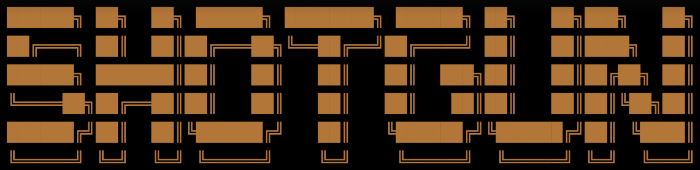

# Shotgun - Alpha




**Fixing the vibe in vibe coding**

Shotgun is a CLI, open source (soon!) **research and spec generation** for AI code-gen tools like Cursor, Claude Code, Lovable, and more…

It will help you with fixing vibes in vibe coding and get you from product and technical research to a product and technical solution design, so you can work with the most popular code-gen tools out there.

---

## **🌟 Key Capabilities**

1. **From Idea to Spec**
    - Converts high-level ideas into detailed, comprehensive technical specifications for Cursor, Claude Code, and Lovable so they follow your ideas more consistently.
    - Work on Product Artifacts:
        - Product Overview
        - User Personas
        - Journeys
        - Roadmaps
        - and more.
    - Technical Architecture:
        - High-Level Architecture Overviews
        - Detailed Architectural Views
        - Data, Flow, and System Diagrams
        - Code examples
    - Deep Technical Research:
        - Compare available solutions, frameworks, and libraries
        - Get in-depth analysis specific to your project
        - Experiment with various approaches
2. **Local-First Architecture**
    - Ensures privacy and control by using the LLMs directly from your machine.
    - Support for locally run LLMs is coming soon.
3. **Multi-Agent, Model-Independent, Artifact-based**
    - Out-of-the box support for OpenAI, Anthropic, Gemini and Moonshot LLM models.
    - Includes web research powered by the above and Exa.ai.
    - Agents can work independently in the background while performing more involved tasks.
    - Agents’ work center around Artifacts containing all their output you fully own.

---

## **🚀 Quick Start**

Follow these steps to get your local Shotgun development environment up and running.

### **Prerequisites**

- Linux or macOS
- git

### **Installation**

Paste this into your command line:

```sh
sh -c "$(curl -fsSL https://install.shotgun.sh/install.sh)"
```

---

After installation, start shotgun with:

```jsx
$ shotgun
```

## **🎯 See in Action**

Video Coming Soon.

### How does a nice looking spec look like?

Image Coming Soon.

---

## **📸 What You Can Try**

**Project: A client wants to turn their specialized knowledge into an expert chatbot, but they want to host it on their own website, not on a third-party platform.**

<aside>

Survey open-source UI kits for building chatbot interfaces (e.g., Vercel AI SDK, Chainlit, Chatbot UI) and evaluate their ease of customization.
Research architectural patterns for securely managing and using OpenAI API keys on a backend server, ensuring they are never exposed to the client.
Explore different strategies and their data storage requirements for managing user-specific conversation histories.

</aside>

**Project: Build a cross-platform mobile app for a local gym that allows members to book classes and track workouts.Research Scope for Shotgun:**

<aside>

Conduct a competitive analysis of existing gym and fitness apps (e.g., Mindbody, Glofox) to establish a baseline feature set for an MVP.
Compare the current state of cross-platform development frameworks (React Native, Flutter, .NET MAUI) based on performance, available UI libraries, and hardware API access (camera for QR codes, etc.).
Investigate third-party services for class scheduling and booking to determine if a "buy" approach is better than "build."

</aside>

**Project: Take on a freelance project to build the MVP for a "peer-to-peer parking spot rental" application.**

<aside>

Analyze the core user flows and business models of established competitors like SpotHero, ParkWhiz, and JustPark.
Investigate the technical requirements and available APIs for integrating online maps and payment processing for a two-sided marketplace.
Research the common legal and liability considerations for peer-to-peer rental platforms in major metropolitan areas.

</aside>

**Project: Standardize the local development environment for a team of 30+ engineers to reduce setup time and eliminate "works on my machine" issues.**

<aside>

Evaluate the trade-offs between container-based local development (Docker Compose, DevContainers) and cloud-based development environments (Gitpod, GitHub Codespaces).
Research strategies and potential pitfalls for migrating a large, existing codebase and team to a standardized environment.
Analyze the impact of each solution on developer hardware requirements and network dependencies.

</aside>

**Project: Build a new, customer-facing data analytics dashboard that can handle complex queries without impacting the performance of the main application.**

<aside>

Compare the features, licensing costs, and performance of third-party embeddable charting libraries (Highcharts, ECharts, etc.) versus a custom D3.js implementation.
Investigate data warehousing and ETL strategies (e.g., using a read replica, materialized views, or a separate analytical database like ClickHouse) suitable for a real-time dashboard.
Research security models and best practices for presenting multi-tenant data visualizations to ensure no data leakage.

</aside>

---

## ✉️ Let Us Know What You Think!

We would be extremely grateful to see your feedback on what we have built. 

Please fill out [the feedback form](https://docs.google.com/forms/d/1ZiW7t9C9wKbMMDxBXvtw6Hv5jqDbtC6juoRTKOehcQY/edit?pli=1) (~5 min), and help us shape the roadmap!
